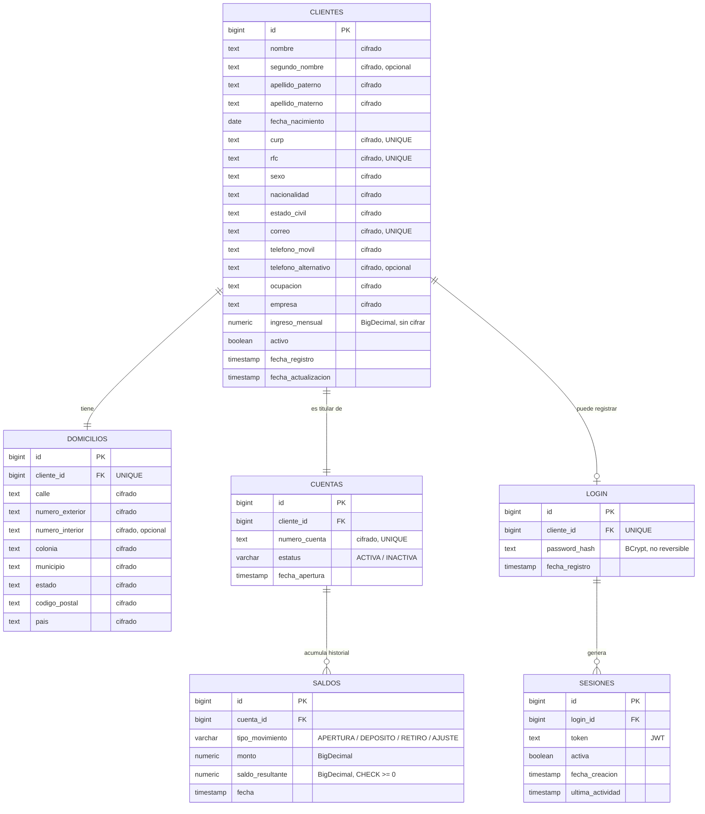

# Diagrama Entidad-Relacion - Modulo de Clientes

## Notas del diseno

- **CLIENTES 1---1 DOMICILIOS**: un domicilio por cliente (`UNIQUE` en `cliente_id`).
- **CLIENTES 1---1 CUENTAS**: cada cliente tiene exactamente una cuenta, creada automaticamente al registrarse.
- **CUENTAS 1---N SALDOS**: cada movimiento de saldo genera una fila nueva; el saldo actual es el de `fecha` mas reciente para esa cuenta.
- **CLIENTES 1---0/1 LOGIN**: un cliente puede o no tener credenciales de portal registradas (se crean aparte, via `POST /auth/registro`).
- **LOGIN 1---N SESIONES**: cada inicio de sesion exitoso genera una fila nueva; la bandera `activa` se apaga sola tras 5 minutos sin actividad.
- Los campos marcados "cifrado" usan `AES/ECB` deterministico (ver `EncryptedStringConverter`), por eso siguen pudiendo llevar `UNIQUE`/busquedas exactas a pesar de estar cifrados.
- Los campos monetarios (`ingreso_mensual`, `monto`, `saldo_resultante`) son `NUMERIC` (BigDecimal en Java), nunca texto ni `double`.
